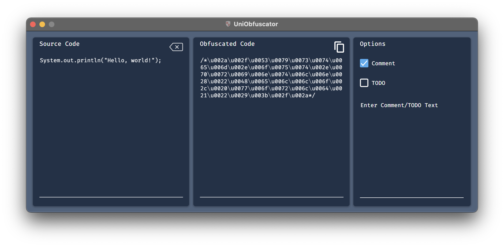

# UniObfuscator
Simple Java Obfuscator that hides code in comment tags and Unicode garbage by making use of Java's Unicode escapes.

<div align="center">
    
</div>

## Prerequisites
* Java >= 8
* Maven

## Usage

### Run
`mvn compile exec:java`

### Generate Fat Jar
`mvn package`

This jar will be generated in `/target`

## What am I looking at?
All entered characters are converted into their unicode equivalent. Comment tags and a TODO label can also be added to further obfuscate the code and make it appear as being ignored in your editor. These all give the appearance of giberish while still being functional lines.

## How does this work?
In Java, it's acceptable to use unicode escapes in replacement or in conjunction with ordinary characters in code. The fake comment works by displaying the literal starting `/*` and ending `*/` blocks but immediately closing them with the corresponding starting `\u002f\u002a` or ending block `\u002a\u002f` in unicode, thus closing the comment block. All obfuscated code will appear inside a comment and be flagged as one by your editor, but is actually encapsulated by two closed blocks `/**/`, thus running fine.

Note that this type of obfuscation should not be performed on class or method headers as this may disrupt your IDE or compilation. Stick to inner code blocks for a smooth experience.

## Is my code secure now?
Bluntly, no. No matter what you do your code will be reverse-engineerable. This tool only performs a simple obfuscation and can be easily converted back into readable characters. This is more of a tool to stop people in a lab from glancing and stealing code than an enterprise-grade solution. If you're interested in more in-depth code obfuscation techniques check out this [guide](https://www.excelsior-usa.com/articles/java-obfuscators.html).

## Example
Source Code
```Java
System.out.println("Hello, world!");
```
Obfuscated Code
```
/*\u002a\u002f\u0053\u0079\u0073\u0074\u0065\u006d\u002e\u006f\u0075\u0074\u002e\u0070\u0072\u0069\u006e\u0074\u006c\u006e\u0028\u0022\u0048\u0065\u006c\u006c\u006f\u002c\u0020\u0077\u006f\u0072\u006c\u0064\u0021\u0022\u0029\u003b\u002f\u002a*/
```
